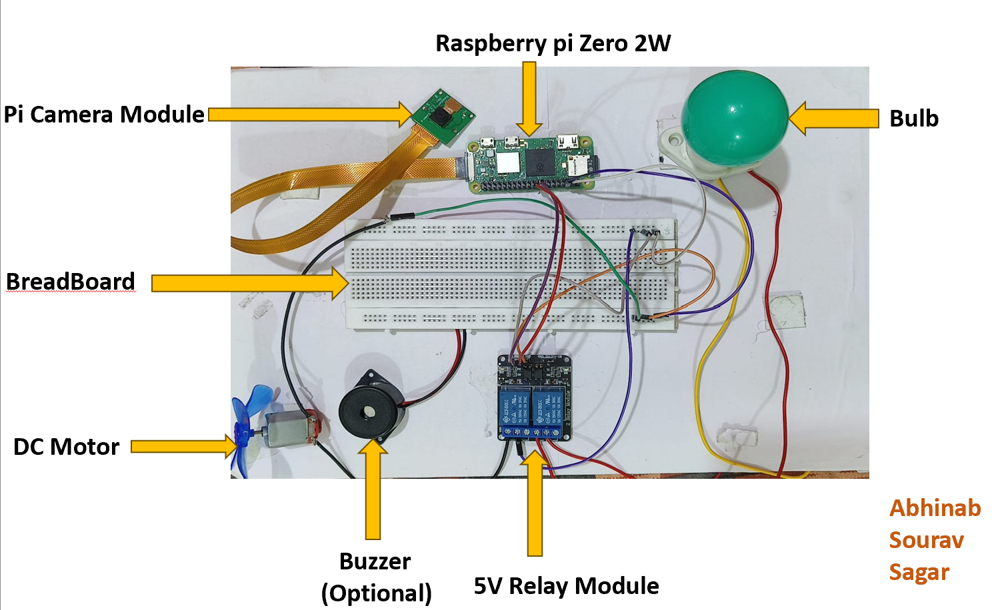
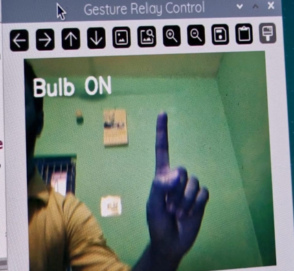
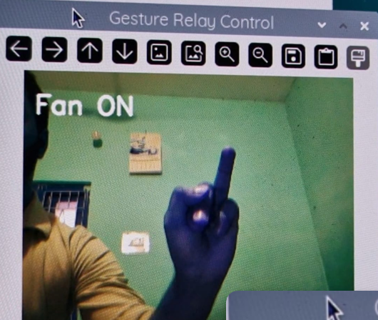

# Hand Gesture Home Automation

Applied IoT (CSE 2198) project — Group 9, ITER, Siksha 'O' Anusandhan University.

We built a system that lets you turn a bulb and a fan on/off using hand gestures instead of switches. It runs on a Raspberry Pi Zero 2W with a Pi Camera, using OpenCV + MediaPipe (through cvzone) to detect which fingers are up, and gpiozero to drive a relay module.

No app, no voice assistant, no remote — just show your hand to the camera.

## Team

Abhinab Kumar Das, Sourav Chakrabarty, Sagar Choudhury

Supervisors: Dr. Biswaranjan Swain, Dr. Bhanja Kishore Swain

## How it works

The camera feed goes through MediaPipe's hand landmark model (wrapped by cvzone), which tells us how many and which fingers are extended. We match that against a fixed set of gestures and send an ON/OFF signal to the relay pins accordingly.

Gestures we used:

- Index finger up → Bulb ON
- Middle finger up → Bulb OFF
- Ring finger up → Fan ON
- Pinky up → Fan OFF
- All 5 fingers up → everything OFF

We picked single-finger gestures because they were the easiest for MediaPipe to detect reliably — anything more complex started giving false positives during testing.

## Hardware

- Raspberry Pi Zero 2W
- Pi Camera Module
- 5V relay module (2 channel)
- Breadboard + jumper wires
- A bulb and a small DC motor standing in for a fan
- Buzzer (we added this for testing, not required)

## Requirements

- Python 3.9+
- OpenCV
- CVZone
- MediaPipe
- NumPy
- gpiozero
- Picamera2 (Raspberry Pi OS)

## Wiring

GPIO 24 (physical pin 18) goes to the relay's IN2, which switches the bulb.
GPIO 23 (physical pin 16) goes to IN1, which switches the fan.
Relay VCC to the Pi's 5V pin, GND to any ground pin.

Double check your relay's trigger voltage before wiring it directly to the Pi's GPIO — some relay boards need 5V logic and will need a transistor/level shifter in between.

## Running it

This needs to run on a Raspberry Pi with the camera enabled (picamera2 isn't something you can pip install on a regular laptop — it comes with Raspberry Pi OS).

```bash
sudo apt update
sudo apt install -y python3-picamera2
git clone https://github.com/Abhinab1177/gesture-home-automation.git
cd gesture-home-automation
pip install -r requirements.txt
python3 main.py
```

Press `q` in the video window to stop it. The `finally` block turns both relays off before exiting, so it shouldn't leave anything stuck on.

## What we found during testing

Recognition worked about 70-80% of the time in normal room lighting, and dropped off a lot in dim light. Each gesture took roughly 4-5 seconds to register, which is slower than we'd like — the Pi Zero 2W isn't exactly fast at running the MediaPipe model, and it warms up noticeably after running for a while. Simple, held-still gestures worked far better than quick or subtle finger movements.

If we did this again we'd probably look at lowering the camera resolution further or using a lighter detection model to cut down that response time.

## Why this matters beyond just being a demo

A gesture-based system like this doesn't need the user to read anything or speak a specific language, which makes it usable for people with speech or motor difficulties. The whole build came in under ₹3000, so it's realistic for people who can't afford commercial smart home kits. Everything is processed locally on the Pi too, so no hand images or video ever leave the device.

## Photos

### Hardware Setup



### Bulb Control using Index Finger



### Fan Control using Ring Finger



## Project Presentation

The presentation used for this project is available in the `docs` folder.

- 📄 [Project Presentation (PPTX)](docs/Project_Presentation.pptx)

## References

- Han, S. N., Lee, G. M., & Crespi, N. (2015). Semantic context-aware service composition for building automation system. IEEE Transactions on Industrial Informatics. DOI: 10.1109/TII.2014.2336594
- https://www.hackster.io/news/gesture-controlled-home-automation-with-raspberry-pi-2f6bcb5e2180
- https://circuitdigest.com/microcontroller-projects/gesture-controlled-home-automation-using-opencv-and-raspberry-pi

## License

MIT

⭐ If you found this project useful, consider giving it a star.